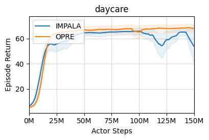
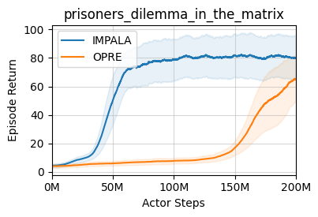

# marl-jax
JAX library for MARL research

[Demo Video](https://youtu.be/WQVQXPIUZxk)
[Paper Link](https://arxiv.org/abs/2303.13808)

# Funding Source
This work was funded at IIIT-H, Hyderabad, India

## Implemented Algorithms
- [x] Independent-IMPALA for multi-agent environments
- [x] [OPRE](https://www.deepmind.com/publications/options-as-responses-grounding-behavioural-hierarchies-in-multi-agent-rl)


## Environments supported
- [x] [Meltingpot](https://github.com/deepmind/meltingpot/)
- [x] [Overcooked](https://github.com/HumanCompatibleAI/overcooked_ai)
- [x] [Sequential Social Dilemma](https://github.com/eugenevinitsky/sequential_social_dilemma_games)

## Other Features
- [x] Distributed training (IMPALA style architecture)
  - Dynamically distribute load of multiple agents across available GPUs
  - Run multiple environment instances, one per CPU core for experience collection
- [x] Wandb and Tensorboard logging
- [x] PopArt normalization

## Help
- [Installation Instructions](installation.md)
- [Environment Details](environments.md)

## Reproduce Fast Local Runs

Use the local installation flow in [installation.md](installation.md). For GPU runs, make sure the environment library path is visible before launching training:

```bash
export LD_LIBRARY_PATH=$CONDA_PREFIX/lib:$LD_LIBRARY_PATH
```

The current local optimization loop is:

1. Benchmark raw environment speed.
2. Run a short training job on the fastest environment that still gives a useful reward signal.
3. Apply an optimization.
4. Re-run the same short benchmark before moving to a harder environment.

### Environment order

For fast iteration, use this order:

1. `ssd/switch`
2. `ssd/harvest`
3. `ssd/cleanup`
4. `overcooked/cramped_room`
5. `meltingpot/...`

`ssd/switch` is currently the best first-stop benchmark because it is both fast and reward-dense enough to validate learning quickly.

### Benchmark commands

Raw environment throughput:

```bash
python scripts/benchmark_short.py env --steps=500
```

Short training benchmark:

```bash
python scripts/benchmark_short.py train \
  --env_name=ssd \
  --map_name=switch \
  --algo_name=IMPALA \
  --num_steps=4000
```

The benchmark script writes a normal training run, then prints a compact JSON summary with:

- final train steps
- mean and last `steps_per_second`
- initial, best, and final mean episode return
- final learner losses

### Recommended short-run checks

Fast reward validation on SSD switch:

```bash
python train.py \
  --env_name=ssd \
  --map_name=switch \
  --algo_name=IMPALA \
  --num_steps=4000 \
  --learner_mode=auto \
  --actor_device=auto \
  --parameter_shuffle_period=0 \
  --learner_prefetch_size=2 \
  --use_tb=False \
  --use_wandb=False
```

Fast reward validation on SSD harvest:

```bash
python train.py \
  --env_name=ssd \
  --map_name=harvest \
  --algo_name=IMPALA \
  --num_steps=4000 \
  --learner_mode=auto \
  --actor_device=auto \
  --parameter_shuffle_period=0 \
  --learner_prefetch_size=2 \
  --use_tb=False \
  --use_wandb=False
```

Fast throughput check on overcooked:

```bash
python train.py \
  --env_name=overcooked \
  --map_name=cramped_room \
  --algo_name=IMPALA \
  --num_steps=4000 \
  --learner_mode=auto \
  --actor_device=auto \
  --parameter_shuffle_period=0 \
  --learner_prefetch_size=2 \
  --use_tb=False \
  --use_wandb=False
```

### Expected short-run behavior

The following were validated on April 13, 2026 on a single NVIDIA GPU using the commands above:

| Environment | Mean steps/s | Last steps/s | Initial mean return | Best mean return | Final mean return | Notes |
|------------|-------------:|-------------:|--------------------:|-----------------:|------------------:|-------|
| `ssd/switch` | `253.4` | `365.2` | `35.5` | `72.0` | `55.5` | Best current fast reward benchmark |
| `ssd/harvest` | `230.2` | `332.7` | `5.0` | `5.0` | `-154.5` | Noisy at 4k steps, but learns and scales well |
| `ssd/cleanup` | `241.0` | `348.1` | `-172.0` | `-147.5` | `-239.5` | Good speed check, weaker short-horizon reward signal |
| `overcooked/cramped_room` | `309.0` | `347.6` | `0.0` | `0.0` | `0.0` | Good throughput check, sparse reward at 4k steps |

For comparison, an earlier `ssd/harvest` baseline in the same repo was around `45.5` mean steps/s, so the current local GPU path is materially faster.

### Important flags

- `--learner_mode=auto`: uses the faster fully parallel learner on GPU when agent count is modest.
- `--actor_device=auto`: keeps local actor and evaluator inference on GPU for single-process runs.
- `--parameter_shuffle_period=0`: disables expensive per-step parameter reshuffling.
- `--learner_prefetch_size=2`: keeps a small number of learner batches prefetched.

## Results

### Daycare

|            | IMPALA     | OPRE       |
|------------|------------|------------|
| Substrate  | 65.944444  | 67.833333  |
| Scenario 0 | 0.888889   | 0.333333   |
| Scenario 1 | 109.111111 | 126.000000 |
| Scenario 2 | 0.222222   | 0.000000   |
| Scenario 3 | 154.555556 | 171.333333 |

### Prisoner's Dilemma in the Matrix Repeated
 

|            | IMPALA     | OPRE       |
|------------|------------|------------|
| Substrate  | 106.849834 | 38.178917  |
| Scenario 0 | 131.002046 | 59.706502  |
| Scenario 1 | 176.537759 | 114.685576 |
| Scenario 2 | 79.583174  | 27.968283  |
| Scenario 3 | 62.804043  | 41.763728  |
| Scenario 4 | 48.626646  | 38.745093  |
| Scenario 5 | 65.819378  | 47.660647  |
| Scenario 6 | 101.830552 | 40.335949  |
| Scenario 7 | 83.325145  | 49.824935  |
| Scenario 8 | 77.751732  | 32.586948  |
| Scenario 9 | 78.408784  | 74.622007  |


## Implementation References
- [Deepmind's Acme](https://github.com/deepmind/acme/)

## Citation

If you use this code in your project, please cite the following paper:
```bibtex
@article{mehta2023marljax,
      title={marl-jax: Multi-agent Reinforcement Leaning framework for Social Generalization}, 
      author={Kinal Mehta and Anuj Mahajan and Pawan Kumar},
      year={2023},
      journal={arXiv preprint arXiv:2303.13808},
      url={https://arxiv.org/abs/2303.13808},
}
```
